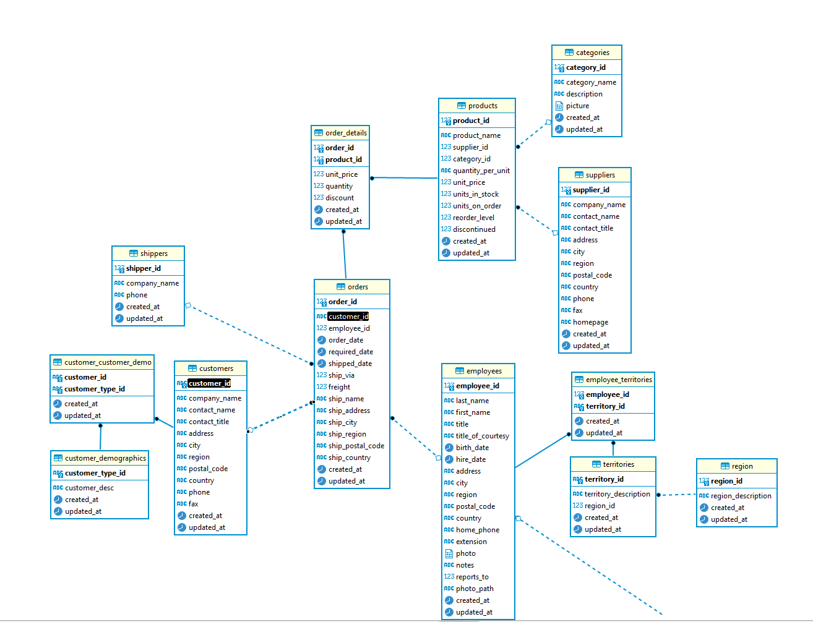

#### DWH

Учебная DWH создано на основе тестовой DB Nortwwind. Использован подход Кимбалла.
Скрипт создания таблиц в корне.

##### Схема DB

##### Схема DWH

##### ETL
C помощью Pentaho DI реализовано наполнение хранилища данными из DB
Трансформации в папке [transformations](./transformations/)

##### Спасибо
За учебные материалы спасибо каналу [Intellik](https://www.youtube.com/c/Intellik)